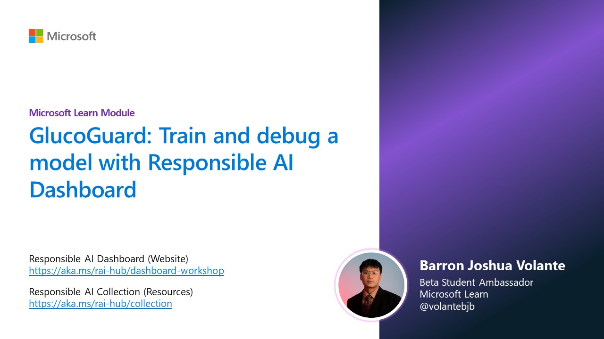

# GlucoGuard

## Overview

GlucoGuard is a machine learning model focused on predicting the likelihood of a diabetic patient's readmission to a hospital within 30 days after being discharged. The model utilizes the Responsible AI Dashboard in Azure Machine Learning Studio to ensure its performance aligns with ethical considerations, such as fairness, inclusiveness, transparency, accountability, and reliability.

**Model**: [Responsible AI Dashboard](https://github.com/ruyakubu/BUILD-AzureML-workshop/tree/main)

**Dataset**: [UCI's Diabetes 130-US hospitals for years 1999–2008](https://archive.ics.uci.edu/dataset/296/diabetes+130-us+hospitals+for+years+1999-2008)

## Credits

This project is based on the Responsible AI Workshop from Microsoft. Credits to the original creator and contributors for providing the foundation for the Responsible AI Dashboard and the associated lab environment.
